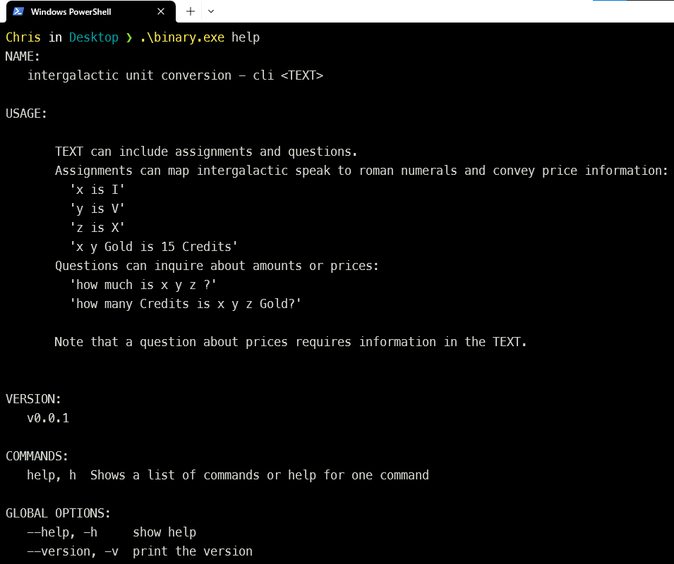
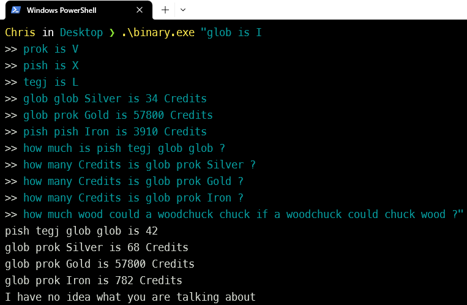

# Itemis Programming Challenge

I chose problem 3. 
You can find the full description in [Problem.md](PROBLEM.md).

Usually, I delete the branch after merging from it.
However, I made an exception this time so you can follow along on the respective feature branches.


# Considerations

A parser is suitable for this kind of problem.
We can wrap the parser in a Command Line Interface (CLI) application to provide some quality of life (QoL) features.
These features may include `help` command, usage information, and examples.

For this project, I will use golang because I am keen to try out the language, and the scope of this project seems like a good opportunity to do so.
Additionally, golang has a nice and readable syntax so that should help reviewing purposes as well.

| Topic | Choice | Notes
| --- | --- | --- |
| Programming Language | [go](https://go.dev/) | `go version go1.20.3`
| CLI Framework |[urfave/cli](https://github.com/urfave/cli) | [Reference](https://github.com/shadawck/awesome-cli-frameworks)
| Testing Framework | `testing` | golang builtin testing framework

# Usage



Pick a release for your operating system and then run the following:

```
# Input your <TEXT> to the binary (without <>)
path/to/binary <TEXT>
# You can also look at the help command
path/to/binary help
```
# Examples



# Help

```
NAME:
   intergalactic unit conversion - cli <TEXT>

USAGE:

       TEXT can include assignments and questions.
       Assignments can map intergalactic speak to roman numerals and convey price information:
         'x is I'
         'y is V'
         'z is X'
         'x y Gold is 15 Credits'
       Questions can inquire about amounts or prices:
         'how much is x y z ?'
         'how many Credits is x y z Gold?'

       Note that a question about prices requires information in the TEXT.


VERSION:
   v0.0.1

COMMANDS:
   help, h  Shows a list of commands or help for one command

GLOBAL OPTIONS:
   --help, -h     show help
   --version, -v  print the version
```